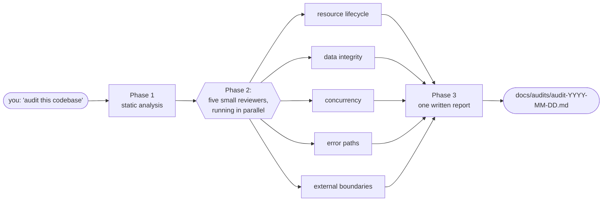
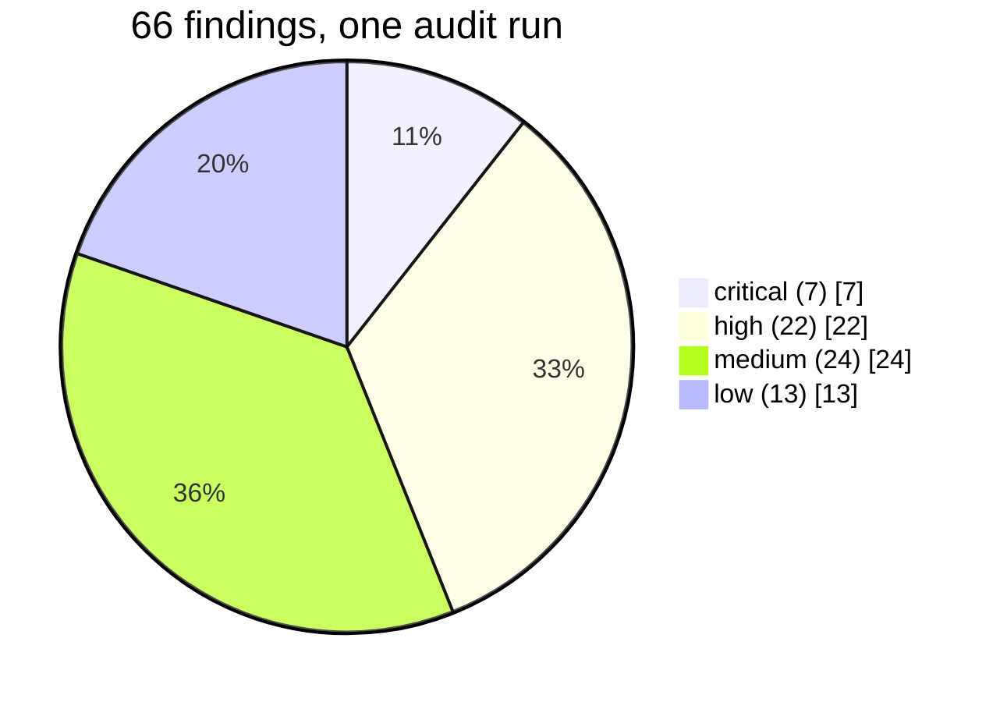

# claude-audit-skill

A small file you drop into [Claude Code](https://www.anthropic.com/claude-code)
that teaches it to go through your code like a careful editor — looking
for leaks, races, swallowed exceptions, missing timeouts, and the
other quiet bugs that only show up when the wrong thing happens at
the wrong time.

You ask "audit this codebase", go make coffee, and come back to a
written report listing every bug it found, with file names and line
numbers. One run. About ten minutes. The rest of the day is just
fixing the list.

## Quickstart

One command, after you clone. The setup script asks where to put the
skills — pick **user-wide** to have them in every project, or
**project-only** to keep them in the current directory.

### macOS and Linux

The exact same command on both. macOS uses bash by default; on Linux
you might be in zsh or fish — the script is plain bash and runs the
same either way.

```bash
git clone https://github.com/MikkoNumminen/claude-skills.git
cd claude-skills
bash setup.sh
```

If you'd rather skip the prompt: `bash setup.sh --target user` (or
`--target project`). Add `--yes` to skip every prompt — handy in CI.
Add `--dry-run` to see what would happen without writing anything.

### Windows

PowerShell — the same shape, different idioms. Works on both stock
Windows PowerShell (5.1) and PowerShell Core (7+). If you only have
Git Bash, the macOS / Linux command above works there too.

```powershell
git clone https://github.com/MikkoNumminen/claude-skills.git
cd claude-skills
.\setup.ps1
```

Skip the prompt with `.\setup.ps1 -Target user` (or `-Target project`).
Add `-Yes` to skip every prompt, `-DryRun` to preview.

### After setup

Restart Claude Code once. Then in any project, type `/mikko-help` and
the wizard tells you what to do next. `/mikko-skills` lists every
skill installed, with a one-line plain-English description per skill.

### What gets installed

Two layouts go into your skills directory:

- The audit skill at `audit/` (legacy single-skill layout from this
  repo's earlier life).
- The `mikko-*` namespace at `mikko-help/`, `mikko-install/`, `mikko-skills/`,
  plus any other `mikko-*` skills under `.claude/skills/` in this repo.

You can install one half at a time if you'd rather — see
[Manual install](#manual-install) below.

### Prereqs

- **Node.js 18+** (the `mikko-*` installer is a Node script).
- **bash** (already there on macOS, Linux, and Git Bash on Windows).
- **PowerShell 5.1+** (stock Windows) or **PowerShell 7+** on Windows.

## What a "skill" even is

If you've used [Claude Code](https://www.anthropic.com/claude-code)
you already know. If not: Claude Code is a command-line assistant
that can read and edit your code. A *skill* is a markdown file that
teaches Claude Code how to do one specific job — like a recipe card.
Drop the card in a folder Claude Code knows about, and from then on,
when you describe the job it recognises the card and follows the
recipe.

This repo holds the recipe card for a code audit.

## Why this recipe is interesting

One Claude looking at a big codebase tends to get distracted. It
starts thinking about race conditions, finds two, then drifts into
checking error handling, forgets the race patterns it was looking
for, and by the time you ask it to summarise, you get five vague
notes about "consider using locks" and not much else.

This skill asks Claude to split the work into **five small reviews
that run at the same time**. Each one is tiny — it only looks at one
thing (say, "file handles that never get closed") and it doesn't get
to drift. When they all come back, their notes get stitched into one
report.

Here's the shape of one run:



The report lists every bug with a link straight to the line of code
that has it, and marks each one critical / high / medium / low. You
pick which ones to fix, in roughly that order.

## What happened the first time it ran

On one mid-sized Python project (about 150 files), one invocation
produced this:

- **66 bugs found**
- **26 of them fixed** the same day, across 7 parallel branches
- ~8 minutes of Claude's parallel-agent time for the audit itself

The severity split looked like this:



For comparison, an ordinary "review this codebase" prompt on the
same project the day before had produced about 8 high-level notes.
Most of those 8 reappeared as concrete findings inside the 66.

That is **one observation on one codebase**, not a controlled study.
The real benefit will vary — your codebase, your languages, your
history. See
[`docs/METHODOLOGY.md`](docs/METHODOLOGY.md) for a reproducible
protocol if you want to measure the effect on your own code.

## What each of the five reviewers looks at

Think of them as five colleagues, each with a different obsession:

1. **The one who closes doors.** Resource lifecycle — files,
   subprocesses, network connections, GUI windows. Asks: "did we
   let go of this properly, or is it still held open somewhere?"
2. **The one who distrusts assumptions about data shape.** Data
   integrity — silent type conversions, encoding mismatches, default
   values that hide an upstream failure. Asks: "what if this came
   in wrong and we never noticed?"
3. **The one who worries about who's running when.** Concurrency —
   two threads touching the same flag, a check-then-act race, a
   background worker that dies silently. Asks: "what happens if
   these run in the wrong order?"
4. **The one who reads every `except` block.** Error paths —
   exceptions that get caught and thrown away, cleanup code that
   only runs on the happy path, retries that lose the final failure.
   Asks: "if this fails, does anyone know?"
5. **The one who eyes the front door.** External boundaries —
   network calls without timeouts, user input going into a file
   path, anything that trusts something outside the program. Asks:
   "what if the world sends us junk, or just goes slow?"

Each one turns in a numbered list of problems with exact line
references. Nothing is fabricated — if they can't point at a real
line of code, they don't include it.

## Manual install

`setup.sh` and `setup.ps1` above do everything in one shot. If you'd
rather install one half at a time — only the audit skill, or only the
`mikko-*` namespace — here's how each piece works on its own.

### Per-project (one repo at a time)

```bash
git clone https://github.com/MikkoNumminen/claude-audit-skill.git
cd claude-audit-skill
./install.sh --target project --repo /path/to/your/repo
```

That creates a symlink from your repo's `.claude/skills/audit/`
back to this repo's `skill/` directory. Later, when you `git pull`
updates here, your repo picks them up automatically — you don't
have to re-install.

### Globally (available in every repo you open)

```bash
git clone https://github.com/MikkoNumminen/claude-audit-skill.git
cd claude-audit-skill
./install.sh --target user
```

Same idea but the symlink goes into `~/.claude/skills/audit/`, which
Claude Code reads on every project.

The installer is careful: if the destination already exists and is
not a symlink, it refuses to overwrite. Re-running is safe — it
just checks and exits.

## A second set of recipes lives here too

The `install.sh` above only knows about the one audit recipe. This
repo has since grown a separate shelf of recipe cards under
`.claude/skills/mikko-*/`, each prefixed `mikko-` so they don't
collide with anything else on your machine. Same file format as
before — just more cards on a different shelf.

Three of those cards are about the shelf itself rather than about
your code:

- **`mikko-help`** — the wizard. You ask "what do I do next", and it
  looks at what's installed and points you at the one command to run
  next. No listing, no recommendations — just a door.
- **`mikko-install`** — the installer for the new shelf. Copies or
  symlinks every `mikko-*` card in one go, into either your project
  or your home directory. Idempotent. Refuses to clobber anything it
  didn't put there itself.
- **`mikko-skills`** — the inventory. A short, plain list of what's
  on the shelf right now, one friendly line per card.

`install.sh` still handles the old `audit/` skill on its own. The
`mikko-install` card handles the `mikko-*` shelf. The two don't
fight — they look at different folders.

### First time on this shelf

There's a small chicken-and-egg: you can't run `/mikko-install` until
`mikko-install` is installed. So the first time, you run its little
helper script directly. There's one for Windows and one for
everything else:

```bash
bash .claude/skills/mikko-install/bootstrap.sh
```

```powershell
powershell -File .claude\skills\mikko-install\bootstrap.ps1
```

Either one copies the three cards above into `~/.claude/skills/` (use
`--target project` instead if you want them only inside this repo),
including replacing any older `mikko-help` you might already have. Once
that's done, restart Claude Code and the new cards are live. From then
on, `/mikko-install` is the way to update — no bootstrap needed.

If you want to read one to see how a card is written, open
[`.claude/skills/mikko-help/SKILL.md`](.claude/skills/mikko-help/SKILL.md).
Same format as `skill/SKILL.md`, just smaller.

## Using it

Open Claude Code in your project and type any of these:

- `audit this codebase`
- `find bugs`
- `robustness review before the release`
- `check for leaks, races, and swallowed exceptions`

Claude Code notices the trigger phrase, loads the recipe card, and
runs. On a mid-sized repo with a GPU-free laptop expect 5–15
minutes total. The written report lands at
`docs/audits/audit-<today's-date>.md`.

If you re-audit the same day, the skill doesn't overwrite — it
writes `audit-<date>-v2.md` so you keep the first run as history.

## What it does **not** do

Honesty matters more than hype. This skill is not:

- **A performance profiler.** If your code is slow, use a profiler.
  This skill wouldn't notice a loop that takes a hundred times
  longer than it should, because speed isn't in its job description.
- **An architecture review.** It looks for concrete bugs on specific
  lines. It won't tell you "these three modules should really be
  one" — that is a design conversation.
- **A security audit.** The scopes overlap (a missing timeout is
  both a robustness bug and a denial-of-service vector) but the
  severity calibration is different. For exploitable vulnerabilities
  use `/security-review` or a human security review.
- **A fixer.** The output is a list of defects, not a patch set. The
  idea is that you read the list, decide which ones matter, and
  either ask Claude to fix them branch by branch or do it yourself.

## Caveats

- **One data point.** The 66-vs-8 comparison is one run on one
  codebase. Repeat on yours to find your own number. See
  [`docs/METHODOLOGY.md`](docs/METHODOLOGY.md).
- **Not free.** Five reviewers running in parallel costs more tokens
  than one reviewer. You're paying for more findings per minute, not
  fewer tokens total.
- **Some false positives.** Pattern-matching is a heuristic. A few
  of the findings will turn out to be fine on closer look. The
  follow-up workflow includes a step where you strike those out with
  `~~strikethrough~~` and a one-line reason, so the tally stays
  honest as you work through the list.
- **Python bias in Phase 1.** The static-analysis tool list is
  strongest for Python (ruff, mypy, bandit, vulture) and decent for
  JS/TS, Rust, and Go. Other languages will mostly skip Phase 1 and
  rely on Phase 2. That's fine — Phase 2 is where most of the
  interesting findings come from anyway.

## Where to go from here

- Read [`docs/METHODOLOGY.md`](docs/METHODOLOGY.md) — full rationale
  for the five-reviewer split, the case-study numbers, and a
  reproducible protocol for measuring it on your own code.
- Peek at [`skill/SKILL.md`](skill/SKILL.md) — the actual recipe
  card Claude Code loads. It's the same file format as the
  [official Claude Code skills catalog](https://www.anthropic.com/claude-code),
  so if you want to write your own skill for a different recurring
  job, this is a fair template.

## Running the tests

There are two small smoke-test suites if you're poking at the
installers and want to know nothing has rotted.

```bash
# install.sh dry-run paths — bash, no framework
bash install.test.sh

# mikko-install behavior — Node, no framework
node .claude/skills/mikko-install/install.test.mjs
```

Both run in isolated tmpdirs and exit non-zero on any failure.
GitHub Actions runs them on every push and PR — see
[`.github/workflows/test.yml`](.github/workflows/test.yml).

## License

MIT. See [LICENSE](LICENSE). Do what you want with it; if it saves
you a day of firefighting, that's enough.
